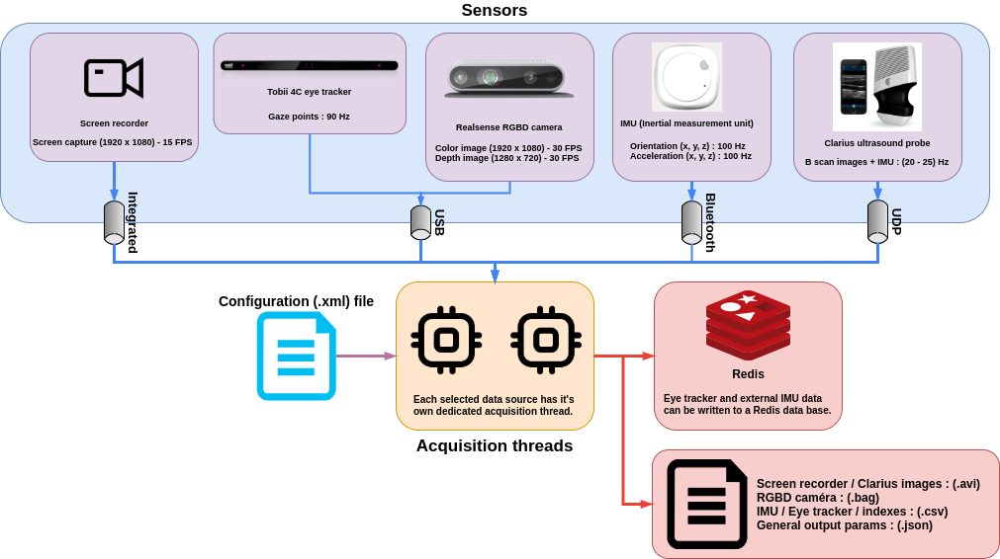

# SonoAsist

## SonoAssist recorder data flow diagram

 

## SonoAssist recorder configuration
#### This section details every entry in the SonoAssist recorder configuration file (.xml).
Note that for all Redis related configurations, the [redis executable](https://github.com/dmajkic/redis/downloads) must be running if data is to be streamed to Redis
#### Parameter descriptions
|Entry Name|Description|
|:--- |:---|
|ext_imu_active|**("true" or "false")** When set to **true**, the recorder app will acquire data from the external IMU unit (sets the default value).|
|us_probe_active|**("true" or "false")** When set to **true**, the recorder app will acquire data from the Clarius ultrasound probe, i.e IMU data and US images (sets the default value).|
|rgb_camera_active|**("true" or "false")** When set to **true**, the recorder app will acquire data from the Intel realsense RGBD camera (sets the default value).|
|eye_tracker_active|**("true" or "false")** When set to **true**, the recorder app will acquire data from the Tobii 4c eye tracker (sets the default value).|
|screen_recorder_active|**("true" or "false")** When set to **true**, the recorder app will acquire data from the built-in screen recorder (sets the default value).|
|us_image_main_display_width|**(Interger)** Defines the width of the ultrasound image display (Clarius probe).|
|us_image_main_display_height|**(Interger)** Defines the height of the ultrasound image display (Clarius probe).|
|measure_eye_tracker_accuracy|**("true" or "false")** When set to **true**, a target image will appear on all 4 corners of the US image display. These red dots are useful for the eye tracker precision measurement script. The default targets are red dots.| 
|eye_tracker_to_redis|**("true" or "false")** When set to **true**, the recorder app will export data streamed from the eye tracker to Redis.|
|eye_tracker_redis_rate_div|**(Integer)** In theory, the Tobii 4C eye tracker can reach a sampling rate of 90Hz. If someone is using the Redis interface for testing or visualization purposes, they may not want to read data at this frequency. This parameter divides the hardware sampling rate to set the new frequency at which data will be written to Redis. Ex: if the actual hardware sampling rate is 60Hz and "eye_tracker_redis_rate_div" is set to 2, gaze data will be written to Redis at a frequency of 30Hz.|
|eye_tracker_redis_entry|**(String)** Defines the key for the Redis list containing the eye tracker data.|
|ext_imu_to_redis|**("true" or "false")** When set to **true**, the recorder app will export data streamed from the external IMU to Redis.|
|ext_imu_redis_rate_div|**(Integer)** same principle as the "eye_tracker_redis_rate_div" parameter.|
|ext_imu_redis_entry|**(String)** Defines the key for the Redis list containing the external IMU data.|
|us_probe_to_redis|**("true" or "false")** When set to **true**, the recorder app will export data streamed from the clarius IMU to Redis.|
|us_probe_redis_rate_div|**(Integer)** same principle as the "eye_tracker_redis_rate_div" parameter.|
|us_probe_redis_entry|**(String)** Defines the key for the Redis list containing the clarius IMU data.|
|us_probe_ip_address|**(String)** Defines the IP address of the Clarius ultrasound probe to connect to.|
|gyroscope_ble_address|**(String)** Defines the Bluetooth address of the gyroscope device (MetaWear C) to connect to.|
|eye_tracker_target_path|**(String)** Defines the path to the image used as the eye tracker targets (for accuracy measurements).|
|eye_tracker_crosshairs_path|**(String)** Defines the path to the image used as the eye tracker crosshairs int the preview display.|

#### Additional development notes 
+ **Connecting to the Clarius probes**
    + The (L738-K-1711-A1500) probe network password: @ATFjm4d
    + Make sure custom firewall rules are activated

## SonoAssist precessing scripts (Python)
#### This section details every entry in the SonoAssist processing scripts configuration file (.json).
#### Parameter descriptions
|Entry Name|Description|
|:--- |:---|
|phys_screen_width|**(Float)** Physical measurement of the width of the monitor used with the eye tracker in meters.|
|phys_screen_height|**(Float)** Physical measurement of the height of the monitor used with the eye tracker in meters.|
|max_gaze_speed|**(Float)** Maximum gaze speed in visual angles per second (deg/sec). This is used for gaze point filtering. Gaze points associated with higher speeds are filtered out.|
|head_data_slice_percentage|**(Integer)**  The size of the slices (in %) the head position data is divided in. Note that an average head position value is calculated for every slice of data. Because, the physical length associated with 1 degree of visual angle changes according to the head position, this value will be calculated for each slice.|
|saliency_map_width|**(Integer)** The size in pixels of the with of the generated saliency maps. Only the width has to be specified because the aspect ratio of the US image display for the recorder tool is preserved.|
|saliency_point_max_reach|**(Integer)** In the saliency map, each gaze point is represented by a 2D gaussian distribution. The standard deviation of the gaussian is associated with the size of 1 degree of visual angle. This parameter **(saliency_point_max_reach)** defines an area limit for the spread of the 2D gaussian distribution. Each gaussian distribution will be represented in a (saliency_point_max_reach x saliency_point_max_reach) px area. The saliency map pixels outside of this area remain unchanged by the gaussian.|
|saliency_map_min_points| **(Integer)** The minimum amount of gaze points required to form a saliency map.|