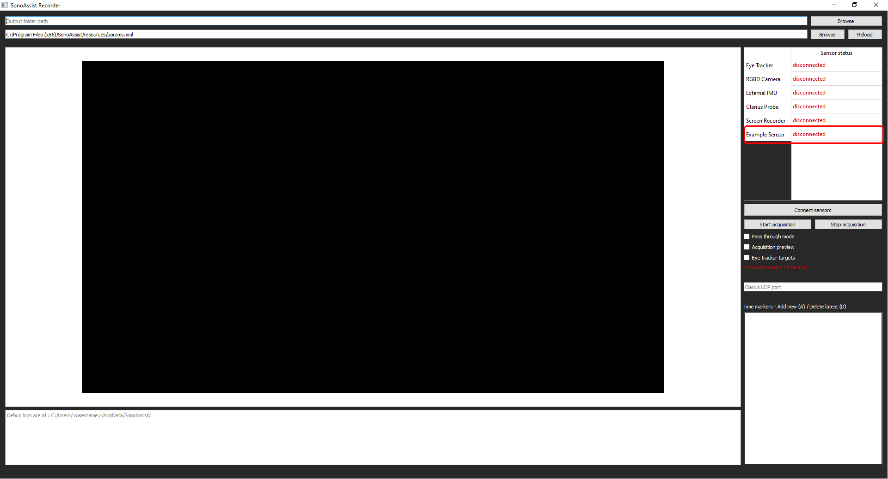

# Welcome to the add-sensor-example branch!

**In this branch, we cover the 6 required steps (in the code) to add support for a new sensor.**

This version of SonoAssist supports an additional sensor called "Example Sensor" for which we highlighted the required development steps via comments of the form: "STEP#N".
The relevant files are the following : 
* [SensorExample.h](https://github.com/LATIS-ETS/SonoAssist/blob/add-sensor-example/SonoAssist/SensorExample.h)
* [SensorExample.cpp](https://github.com/LATIS-ETS/SonoAssist/blob/add-sensor-example/SonoAssist/SensorExample.cpp)
* [SonoAssist.h](https://github.com/LATIS-ETS/SonoAssist/blob/add-sensor-example/SonoAssist/SonoAssist.h)
* [SonoAssist.cpp](https://github.com/LATIS-ETS/SonoAssist/blob/add-sensor-example/SonoAssist/SonoAssist.cpp)
* [acquisition_params.xml](https://github.com/LATIS-ETS/SonoAssist/blob/add-sensor-example/SonoAssistParams/acquisition_params.xml)
* [CMakeLists.txt](https://github.com/LATIS-ETS/SonoAssist/blob/add-sensor-example/SonoAssist/CMakeLists.txt)

Example sensor on the side panel

